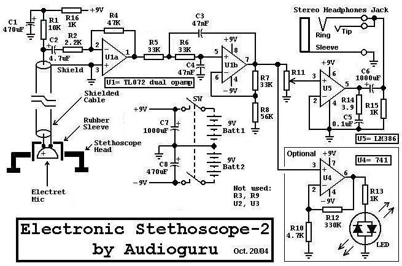
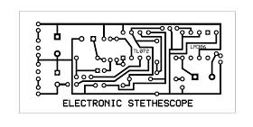
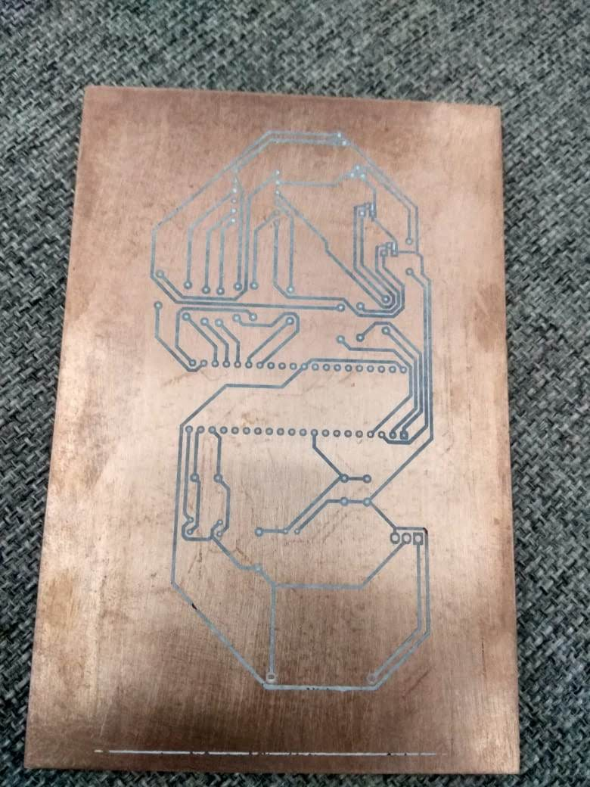

# Analog Electronic Stethoscope & Acoustic Amplifier

An active analog signal-conditioning circuit designed to amplify low-frequency biological acoustic signals (such as heartbeats and lung sounds) while filtering out high-frequency ambient noise using active op-amp filtering and power amplification.

---

## 📌 Project & Technical Overview

Biological acoustic signals (like heartbeats) typically reside in low frequency ranges (~20 Hz – 200 Hz) with extremely low amplitudes. Standard acoustic stethoscopes struggle in noisy environments. 

This project implements a hardware-based signal processing pipeline to convert acoustic vibrations into a clean, amplified audio output capable of driving standard 32Ω headphones:

1. **Acoustic Transduction:** An electret condenser microphone coupled to a stethoscope chest piece converts pressure waves into low-voltage AC signals.
2. **Preamplification & Active Bandpass Filtering:** Uses a **TL072 low-noise dual op-amp** stage to provide low-noise gain and attenuate out-of-band high-frequency acoustic noise.
3. **Power Output Stage:** Uses an **LM386 audio amplifier IC** to drive standard stereo headphones with adjustable volume control.
4. **Dual-Rail Power Supply:** Powered by a split $\pm 9\text{V}$ power supply to maximize op-amp dynamic range and signal headroom without clipping.

---

## 🛠️ Circuit Architecture & Schematic Analysis

Below is the signal-processing pipeline for the stethoscope, showing how raw acoustic input is conditioned into high-fidelity audio output:

### Key Subsystems:
* **Transducer Interface:** Electret mic biased via a resistor/capacitor network with shielded cabling to reject EMI/RFI noise.
* **Filter Topology:** A active 2nd-order low-pass filter (Sallen-Key topology) configured around the TL072 to block high-frequency hiss above human cardiovascular interest.
* **Volume Control:** 10k potentiometer at the input of the LM386 stage for manual gain adjustment.

---

## 📐 Hardware Fabrication & PCB Design

* **EDA & Layout:** Circuit schematic and PCB track routing performed using EDA software.
* **Prototyping Method:** Single-sided copper-clad board (FR4) custom-etched using chemical toner transfer / etching methods.
* **Component Placement:** Optimized trace routing to separate low-level analog input signals from high-current audio output traces to minimize crosstalk and feedback oscillation.

---

## 📷 Media & Hardware Artifacts

| Circuit Schematic | PCB Trace Layout | Etched Prototype Board |
| :---: | :---: | :---: |
|  |  |  |

---

## 👥 Credits & Attribution

* **Original Circuit Concept:** Based on the analog electronic stethoscope circuit published on [AaronCake.net](https://www.aaroncake.net/circuits/steth.asp) (Circuit design by *Audioguru*).
* **Hardware Layout & Prototyping:** PCB trace layout, chemical etching, board fabrication, and testing executed by **Brandon Saldanha**.

---

## 📜 License

Distributed under the **MIT License**. Free for educational and open-source use.
